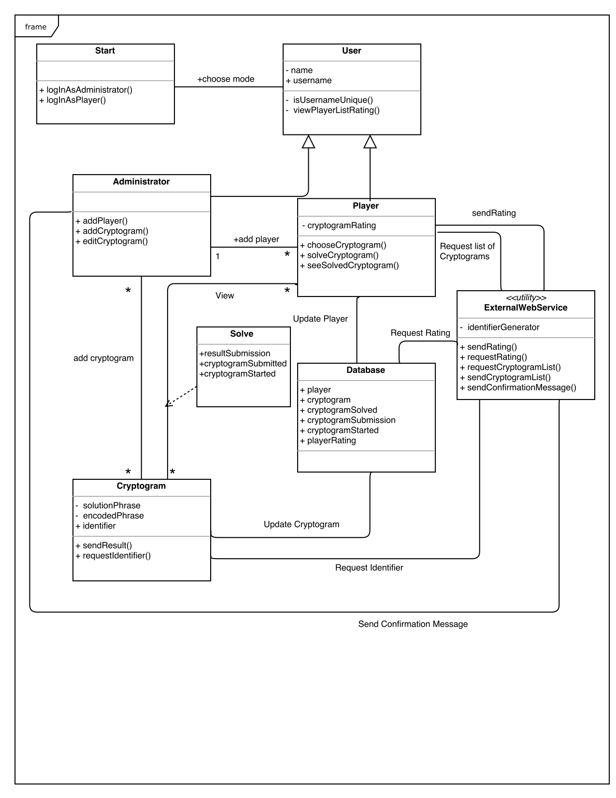
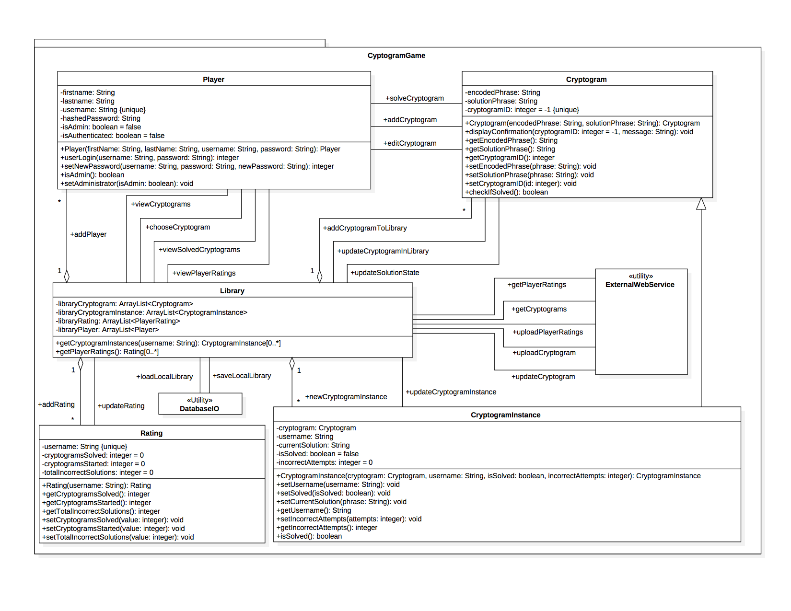
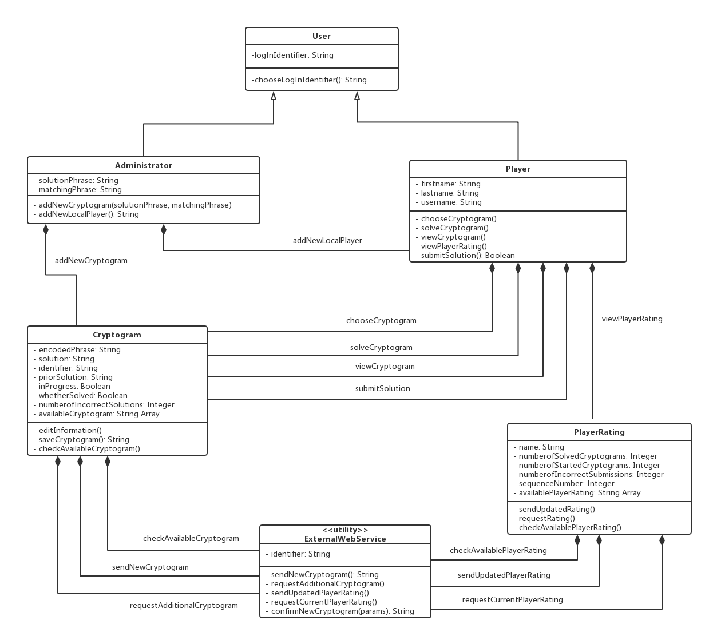
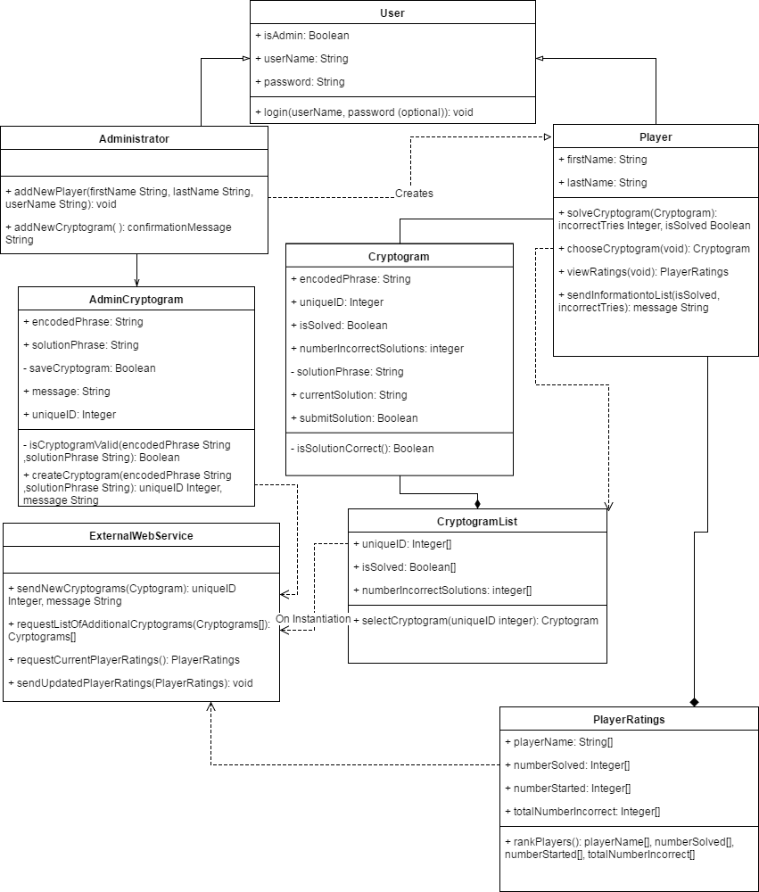
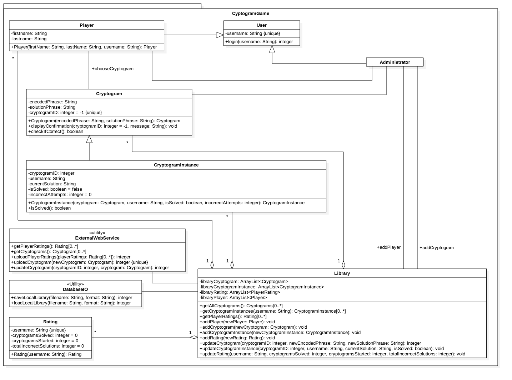

# **SDPCryptogram App**

Deliverable 1 - Preliminary Work

Summer 17 - Team 45

----------

## **Individual Designs**

### **Design 1 -- swang632**

**Pro's**

- Method names are easy to understand and match very closely with the requirements.
- The Database class makes it apparent where all of the relevant information is stored. 
- Good use of an association class
- Identifies / Checks that the username should be/is unique

**Con's**

- isUsernameUnique() is not required because the requirements state the Admin has to figure it out
- Because the admin is a subclass of User, it inherits unnecessary functionality such as username and the viewPlayerListRating()
- The encoded phrase in the Cryptogram should not be private.
- Unneccesary / missuse of quantifiers on associations
- "PlayerRating" is supposed to be a rating of a certain player's skills, not a certain player's opinion of a specific cryptogram
- No user-specific tracking of cryptogram isSolved. If one player solves it an the flag is flipped it will be solved for everyone.
- Database description is ambiguous and satisfies more requirements of the PlayerRating class than database functionality and does define the method of local persistence

### **Design 2 -- chobbs30**

**Pro's**

- Everything accessing the central library makes the layout of communications more simple. 
- Very well organized and descriptive. Because every connection is labeled, it is much easier to know how each class communicates with the others. 
- It is clear where the collections of things are (such as players, cryptogram lists, etc.)

**Con's**

- Some details may be unnecessary such as the getters and setters in the cryptogram class.
- The option of the player to be an admin gives the admin more functionality than they need (all the player functionality potentially). A separate class for admin is better since it doesn’t require any user name or other parameters according to the requirements.
- For the players class, the viewCryptograms, viewSolvedCrytograms and chooseCryptograms operations do not need to be separate functions. 
- It is unclear which classes the transition methods belong to. While it may not matter, it may affect the implementation. 
- ExternalWebService class should have some actions. 
- CryptogramInstance to contain cryptogram as one of the attributes can be large in storage. Ideally for the N users and M crytograms, the N-by-M mapping matrix, for the isSolved, isCorrect, and solutions seem to be sufficient.
- Constant update for the Library/CryptogramInstance rather than update upon calling can be computation expensive

### **Design 3 -- zguang3**

**Pro's**

- Number of classes is efficient which makes the flow easy to understand
- External web service utility has communication limited to two other classes.
- Good use of generalizations / inheritance
- Tracking of if a cryptogram has been started / is in progress and what the current attempted solution is

**Con's**

- Unclear which parameters are public verse private
- Not immediately apparent where the cryptograms are being solved verse stored
- Solution/Matching phrases are attributes of a cryptogram not of an admin user
- Missuse of composition relationship connectors --> Should be associations
- whetherSolved (isSolved) attribute is embedded in the cryptogram and not tracked per-user instance. When one player solves a cryptogram and the boolean is flipped, it will be flipped for all users
- No local database handling or method of maintaining local persistence 
- The arrow's direction is reversed
- username should be an attribute of user rather than player
- identifier should not be an attribute of external web service

### **Design 4 -- hfederman3**

**Pro's**

- Nice layout, easy to read
- Good use of generalizations / inheritance
- CryptogramList class simplifies the viewing and solving of cryptogram by each player

**Con's**

- No local database handling or method of maintaining local persistence
- isSolved attribute is not user-specific. Same as previous, once solved by one user, solved for all
- CryptogramList duplicates attribute data from Crytpogram but does not actually store or list any Cryptogram objects
- Multiple return types from the same function
- Cryptogram and AdminCryptogram classes introduces duplication and complexity
- Class variable should rarely be public
- submitSolution should not be an attribute of cryptogram
- AdminCryptogram class for only the addNewCryptogram method might be overkill

-------------

## **Team Design**

### **Commonalities and Differences**

**Design 1 ---swang632**

Commonalities
1. Both create a database class to store the data
2. Both create user and administrator class and use the generalization structure to show the relationship between use, player and administrator.

Differences
1. The team design introduces a library class, which only exist while the app is running.
2. The team design introduces a CryptogramInstance class which is used for players to choose and solve the cryptograms.
3. The team design introduces a Rating class to record the player’s grade in the game.

**Design 2 -- chobbs30**

Commonalities
1. Both introduced a library class and a CryptogramInstance class to express the relationship more clearly.
2. Both introduced a database class to store the data.
3. The relationship between different classes are same.

Differences
1. The individual design’s player class was replaced by a generalization class which include 3 different class, user, player and admin.
2. The team design generalize the actions of different class to make it more clear and easy to read.

**Design 3 -- zguang3**

Commonalities
1. Both create user and administrator class and use the generalization structure to show the relationship between use, player and administrator.
2. Both introduced a rating class to record the player’s grade.

Differences
1. The team design introduces a library class, which only exist while the app is running.
2. The team design introduces a CryptogramInstance class which is used for players to choose and solve the cryptograms.
3. The team design introduces a database class to store the game data.

**Design 4 -- hfederman3**

Commonalities
1. Both create user and administrator class and use the generalization structure to show the relationship between use, player and administrator.
2. Both introduced a cryptogram list class(cryptogramInstance in team design) which is used for players to choose and solve the cryptograms. 
3. Both introduced a rating class to record the player’s grade

Differences
1. The team design introduces a library class, which only exist while the app is running.
2. The team design introduces a database class to store the game data.

### **Main Points of the Design and Decision**

**Design 1 ---swang632**

This design has a very clear UML diagram to fulfill each requirement. The use of Database make it convenient to store all the relevant information locally. However, the detailed implementation could have a few problems. The inheritance of the Administrator class and Player class from the User class will need to be redefined because of unnecessary inheritance such as username and viewPlayListRating() in the child classes. The Database class can be over aggressively defined to contain a mixture of different functionalities, such as the PlayRating update. 

**Design 2 -- chobbs30**

We choose to modify this design as the Team Design: class diagram considerately designed and the relations clearly labeled. The use of a local Library to process cryptogram and player rating requests is convenient. All the functions that associate two or more classes are all along the connecting lines. We put them into class boxes in the Team Design, and get rid of the setter and getter methods in the UML as they won't influence the structure of the design. 

**Design 3 -- zguang3**

This design has an efficient number of classes and number of connections to the external web service utility class, so the flow is very clear and easy to understand. But the implementation with Cryptogram and PlayerRating class to take care of the local storage, without the use of Database class, can be difficult. As well, the class private access and relation lines need to be fixed. 

**Design 4 -- hfederman3**

This design has a well-defined inheritance and class structure. Specifically, the definition of CryptogramList can handle requests regarding cryptograms from each player. However, the lack of a local database can have problem to store and track local cryptogram and player ratings changes. The addition of AdminCryptogram class to implement only the addNewCryptogram() function might be redundant to the class Cryptogram and add extra complexity. 

-------------

## **Summary**
  There were a few good lessons learned throughout the process of finalizing the team design for this project. 
  
  First, interpreting requirements can be difficult and different people are likely to interpret them differently. This came up specifically around the requirements for the administrator and how they authenticate and/or login. The team came to alignment on how to proceed forward, but different members held different interpretations about what the requirement actually meant.
  
  Second, the team saw that one requirement could be implemented in many different ways. One example was again around the administrator implementation. Some members implemented it with a user class that then had children of the administrator and player classes while others implemented the administrator and player with a single class. Neither implementation was inherently right or wrong and each had their own benefits. After weighing these options, we decided to move forward with using the derived classes in order to segregate functionality more.
  
  Last, the team learned how important good communication and communications methods are. Slack was used as the tool to communicate and hold meetings. This was effective in that it allowed all of us to communicate via instant message. The main drawback was that the communication was a bit slow due to the time typing responses. This did force the team to be concise in communication style and decision making which was definitely a positive. 
  
  Overall the main take away from this assignment was that there are many ways to accomplish a task, whether it be an interpretation of a requirement, an implementation of design, or a communication method. The most important thing is aligning as a team and picking the best path forward.

-------------
