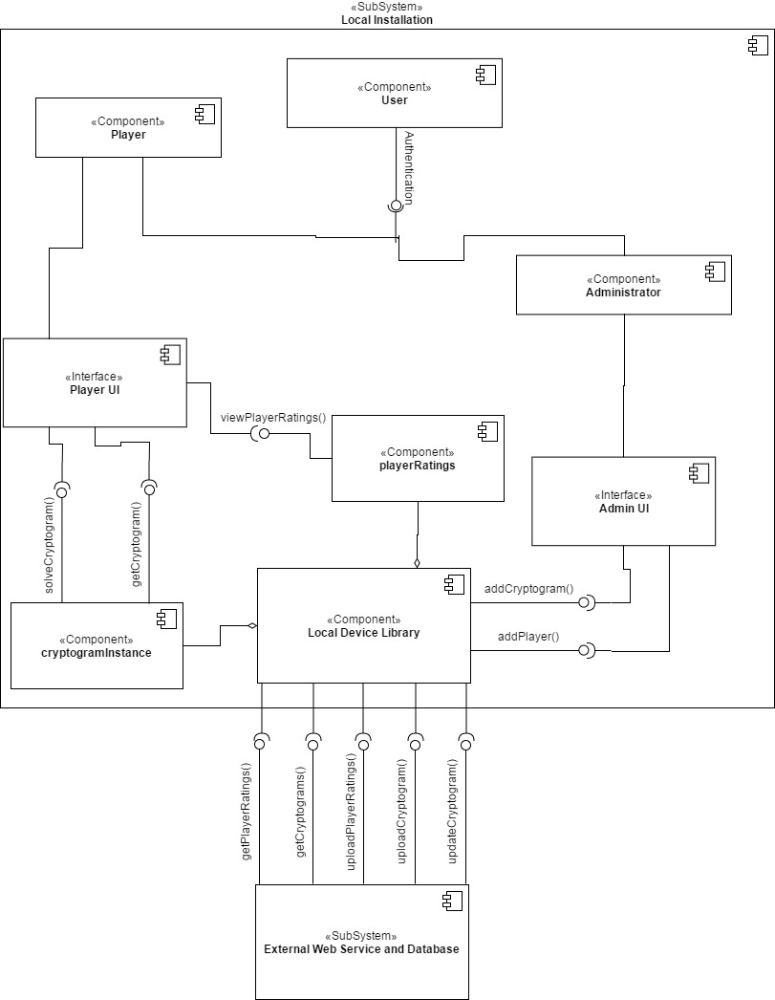
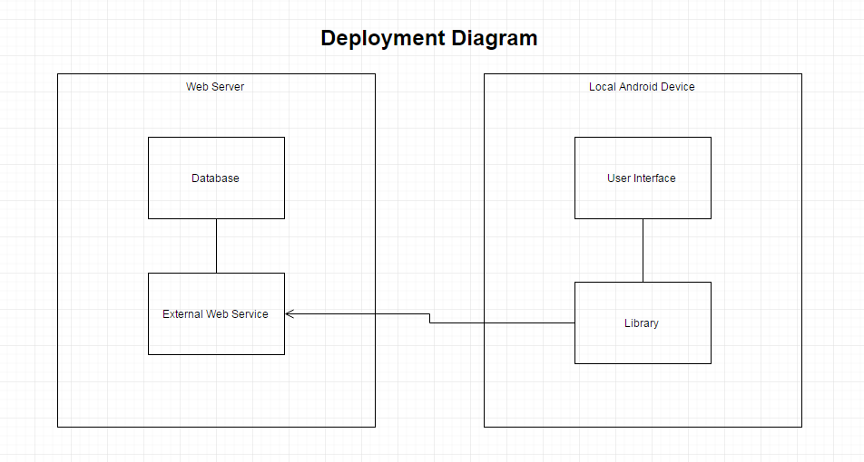
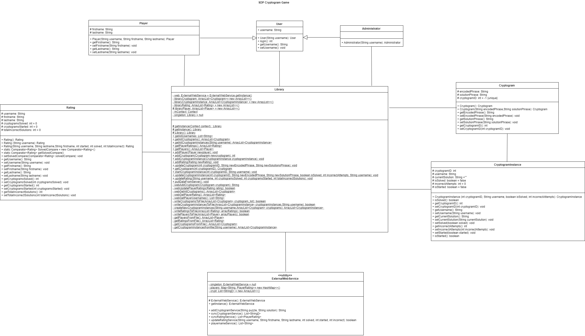
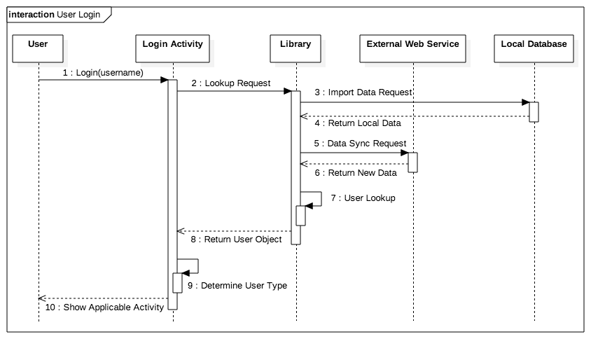
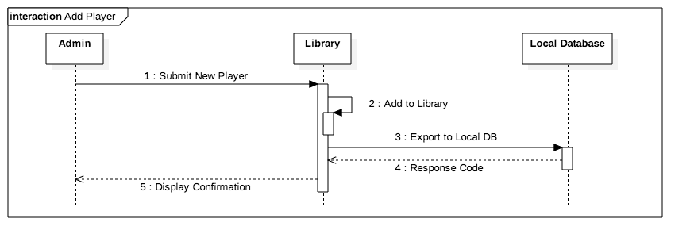
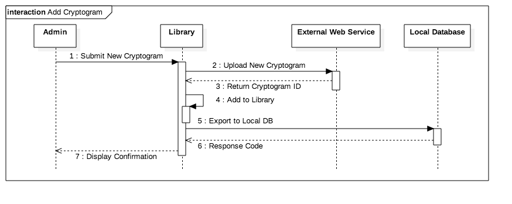
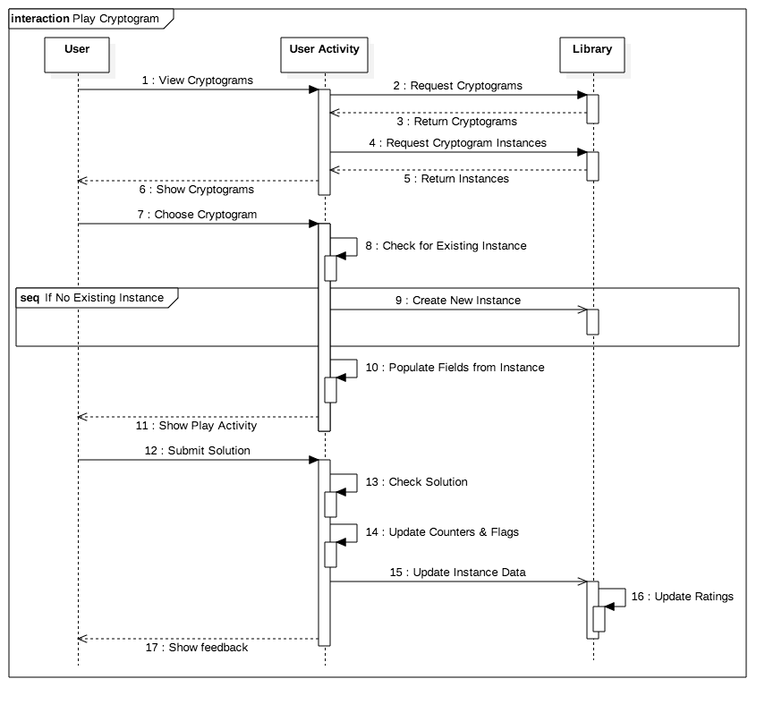
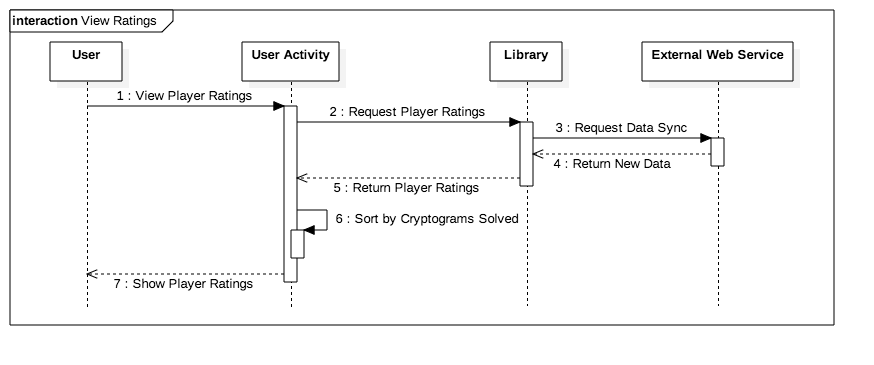
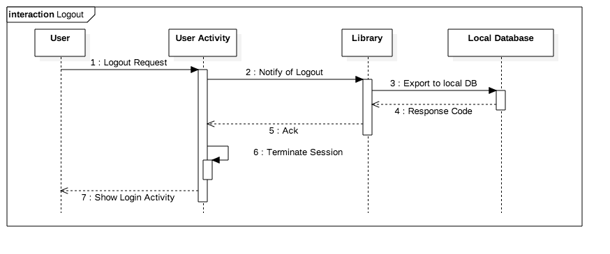
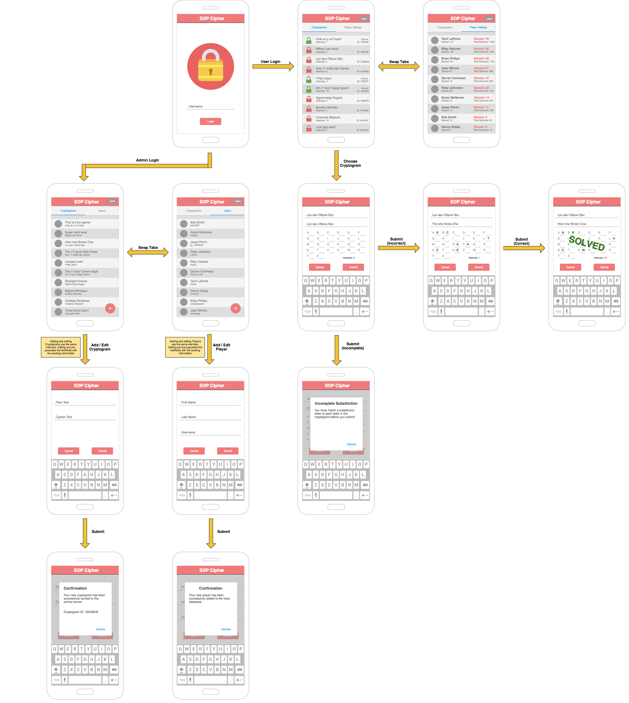

# Design Document

**Author**: Team 45

## 1 Design Considerations

### 1.1 Assumptions

The application being built is, as described in the given requirements, an Android platform application for storing and solving cryptograms. It is assumed that each user accessing the application, either as a player (someone solving the cryptogram) or a as an administrator (a user who adds players as well as creates and edits cryptograms). Each device will have a connection to the internet in order to access the external web service where cryptograms and player ranking information will be stored. The device on which the application is run will also have a sufficient amount of available internal storage space to support a local database of application data. 

### 1.2 Constraints

#### 1.2.1 Network Connectivity

The application is constrained by the network connectivity of the device as provisioned by the primary user. Lack of network connectivity will isolate that application data to only what is locally present on the device. 

#### 1.2.2 Hardware Environment

The runtime performance is impacted by the hardware environment on which it is run. Processor speed, available memory and storage, battery life, etc will all affect the user's experience. 

#### 1.2.3 Interoperability

In order to allow this application to be utilized by the widest possible audience we must consider what minimum Android API level to develop at. This will impact the design of the application as some never features may not be available in older API versions.

We must also consider varying screen sizes, resolutions, and aspect ratios. When designing the UI, the elements must employ relative positioning to ensure the UI is usable regardless of the screen specifications.

#### 1.2.4 Development Experience 

The ability to use advanced features and techniques for developing Android apps may be impacted by a potential lack of experience.

### 1.3 System Environment

The application must be used on an Android device or emulator (Minimum Version TBD). As previously stated, the device must have internet access in order to exchange data with an external web service. The device must also provide some form of internal storage to enable a local database to be created for the application data.

## 2 Architectural Design

### 2.1 Component Diagram

### 2.2 Deployment Diagram

This diagram shows the server's interaction with a single Android device. In practice, the server could communicate with any local installation of the application.

## 3 Low-Level Design

### 3.1 Class Diagram

### 3.2 Other Diagrams

#### 3.2.1 User Login Sequence

#### 3.2.2 Add Player Sequence

#### 3.2.3 Add Cryptogram Sequence

#### 3.2.4 Play Cryptogram Sequence

#### 3.2.5 View Ratings Sequence

#### 3.2.6 User Logout Sequence

## 4 User Interface Design

