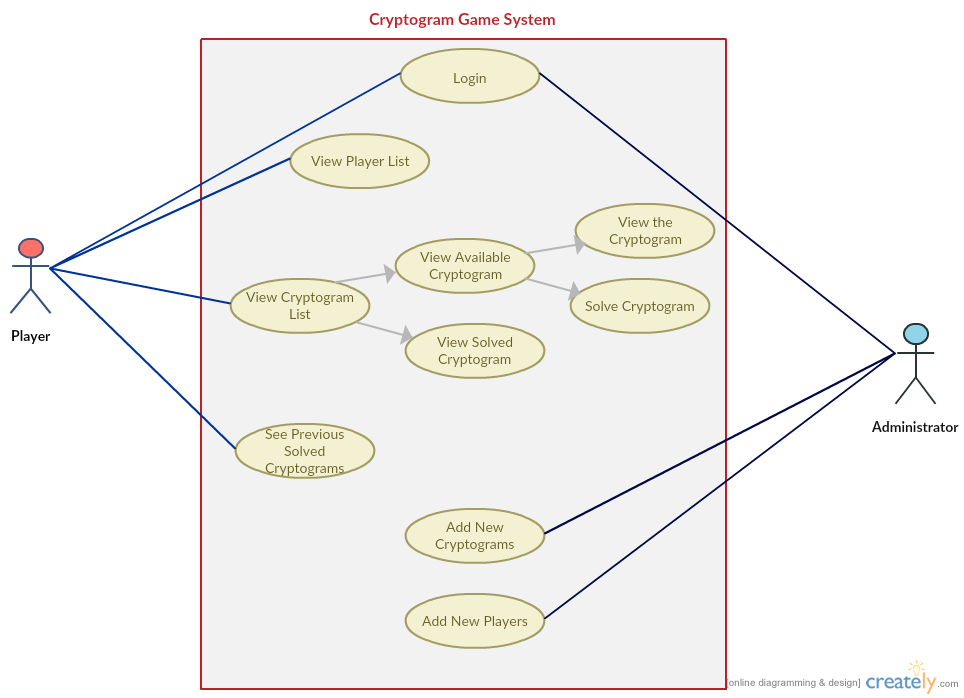

# Use Case Model

**Author**: Team45

## 1 Use Case Diagram 

## 2 Use Case Descriptions

UC1 - Log in

	R1 - The player and admin should be allowed to log in the system.
	
	Pre-condition: none
	
	Post-condition: The user log in as player/admin

	Scenario: 
	1. User opens apps.
	2. User selects mode.
	3. User enters username.
	4. User enters password.
	5. Log in the system.
	

	5.1 username does not exist.
	5.2 password is not correct.
	5.3 user mode not selected

UC2 - Add Cryptograms

	R2 - The admin should be allowed to create and edit cryptograms.

	Pre-condition: log in as administrator

	Post-condition: A new cryptogram with an unique identifier must be created.

	Scenario:
	
	
	1. Admin selects "Add Cryptograms".
	2. Admin enters a solution phrase.
	3. Admin enters a matching encoded phrase.
	4. Admin submit the complete cryptogram.
	5. Changes are saved
	
	4.1 Admin input invalid.
	4.2 Admin prompted to try again.
	5.1 Application runs into error.
	5.2 Admin prompted to try again.

UC3 - Add Players
	
	R3 - The admin should be allowed to add players.
	
	Pre-condition: log in as administrator
	
	Post-condition: A new player with an unique username must be created.
	Scenario:
	
	1. Admin selects "Add Players".
	2. Admin enters player‘s first name.
	3. Admin enters player's last name.
	4. Admin enters player's username
	5. Admin submit player information to the system
	6. Changes are saved.
	
	5.1 Admin input invalid.
	5.2 Admin prompted to try again.
	6.1 Application runs into error.
	6.2 Admin prompted to try again.

UC4 - View Player List

	R4 - The player should be allowed to view a player list.

	Pre-condition: The user log in as player.

	Post-condition: List must be displayed for further actions.

	Scenario:
	
	1. Player select to view player list.
	2. The apps display players grades on the list.

UC5 - View Cryptogram List

	R5 - The player should be allowed to view a cryptogram list.

	Pre-condition: The user log in as player.

	Post-condition: List must be displayed for further actions.

	Scenario:
	
	1. Player select to view cryptogram list.
	2. The apps display the available cryptograms on the list.
	3. Player is given options to view previous solved cryptogram list or available cryptogram list.

UC6 - View Previous Solved Cryptogram

	R6 - The player should be allowed to view a solved cryptogram list.

	Pre-condition: The user log in as player.

	Post-condition: List of previous solved cryptograms must be displayed.

	Scenario:
	
	1. Player select to view previous solved cryptogram list.
	2. The apps display the previous solved cryptograms on the list.

UC7 - View Avilable Cryptogram

	R6 - The player should be allowed to view a solved cryptogram list.

	Pre-condition: The user log in as player.

	Post-condition: List of previous solved cryptograms must be displayed.

	Scenario:
	
	1. Player select to view avilable cryptogram list.
	2. The apps display the previous solved cryptograms on the list.
UC8 - Choose Cryptogram

	R7 - The player should be allowed to view a solved cryptogram list.

	Pre-condition: The player opened the available cryptogram list.

	Post-condition: Options must be displayed for further actions.

	Scenario:
	
	1. Player select to view previous solved cryptogram list.
	2. The apps display players grades on the list.
	3. Player is given options to view cryptogram information and solve the cryptogram problem.

UC9 - View Cryptogram Information

	R8 - The player should be allowed to view a solved cryptogram list.

	Pre-condition: The player chose one cryptogram.

	Post-condition: The cryptogram information must be displayed.

	Scenario:
	
	1. Player select to view the cryptogram information.
	2. The apps display players grades on the list.
	3. Player is given options to view the cryptogram information and solve the cryptogram.

UC10 - Solve Cryptogram 

	R9 - The player should be allowed solve the chosen cryptogram.

	Pre-condition: The player chose one cryptogram.

	Post-condition: The player receive feedback whether the cryptogram is solved and the playing record are changed.

	Scenario:
	
	1. Player select to solve the cryptogram.
	2. The apps display the cryptogram problem
	3. Player edit the solution to the cryptogram
	4. Player submit the solution to the system
	5. The system give feedback of player's solution
	6. Record saved

	4.1 Application runs into error.
	4.2 Player prompted to try again.
	4.3 Player input invalid
